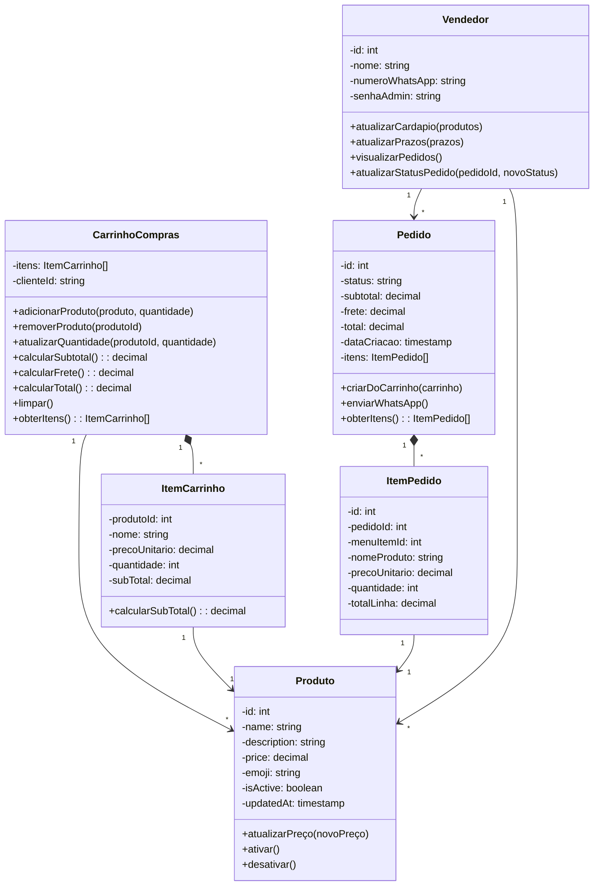
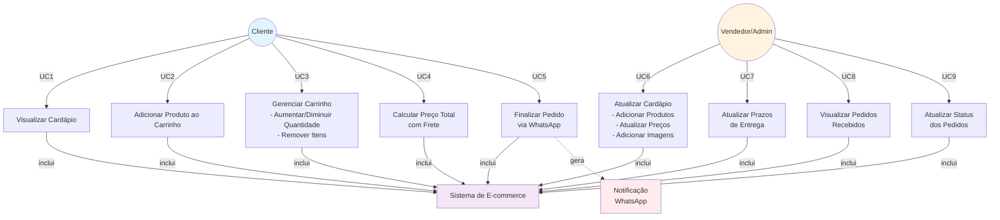

# 📊 Diagramas UML - Sistema de E-commerce de Biscoitos

## Diagrama 1: Diagrama de Classes



### Descrição das Classes:

| Classe | Responsabilidade |
|--------|-----------------|
| **Produto** | Representa um item do cardápio com preço, descrição e status |
| **CarrinhoCompras** | Gerencia os produtos selecionados pelo cliente (persistido em localStorage) |
| **ItemCarrinho** | Um produto específico no carrinho com quantidade e preço |
| **Pedido** | Pedido finalizado com cálculo de subtotal, frete e total |
| **ItemPedido** | Detalhe de cada produto em um pedido (armazenado no PostgreSQL) |
| **Vendedor** | Admin que gerencia cardápio, prazos e pedidos |

---

## Diagrama 2: Diagrama de Casos de Uso



### Descrição dos Casos de Uso:

#### **Cliente (5 casos de uso)**
| UC | Caso de Uso | Descrição |
|----|-----------|-|
| **UC1** | Visualizar Cardápio | Cliente consulta todos os produtos disponíveis |
| **UC2** | Adicionar ao Carrinho | Cliente adiciona um produto ao carrinho |
| **UC3** | Gerenciar Carrinho | Cliente altera quantidades ou remove itens |
| **UC4** | Calcular Preço Total | Sistema calcula subtotal, frete (5% mín. R$ 10) e total |
| **UC5** | Finalizar Pedido | Cliente envia pedido via WhatsApp ao vendedor |

#### **Vendedor/Admin (4 casos de uso)**
| UC | Caso de Uso | Descrição |
|----|-----------|-|
| **UC6** | Atualizar Cardápio | Vendedor adiciona/edita produtos e imagens |
| **UC7** | Atualizar Prazos | Vendedor altera prazos de entrega e encomenda |
| **UC8** | Visualizar Pedidos | Vendedor consulta pedidos recebidos |
| **UC9** | Atualizar Status | Vendedor muda o status dos pedidos (pending → processando → enviado, etc.) |

---

## Fluxo de Dados do Sistema

```
CLIENTE                        SERVIDOR NODE.JS              BANCO DE DADOS (PostgreSQL)
   │                                │                                    │
   ├─ Visualiza cardápio ────────> GET /api/menu ────────────────────> SELECT * FROM menu_items
   │                                │                                    │
   ├─ Adiciona ao carrinho ──────> localStorage (browser-side)          │
   │   (sem servidor)               │                                    │
   │                                │                                    │
   ├─ Finaliza pedido ───────────> POST /api/orders ───────────────────> INSERT INTO orders
   │   via WhatsApp                 │                                    │
   │                                ├──> Envia WhatsApp ────────────>   (notificação externa)
   │                                │    ao vendedor                      │
   │                                │                                    │
   └─ Recebe link WhatsApp ────────┘                                    │
                                                                         │
VENDEDOR                       SERVIDOR NODE.JS              BANCO DE DADOS (PostgreSQL)
   │                                │                                    │
   ├─ Atualiza preço ───────────> PUT /api/menu/:id ────────────────> UPDATE menu_items
   │   (com senha)                  │                                    │
   │                                │                                    │
   └─ Visualiza pedidos ────────> GET /api/orders ────────────────────> SELECT * FROM orders
                                    │                                    │
                                    └──> JOIN com order_items ───────────
```

---

## Tecnologias Utilizadas

| Componente | Tecnologia |
|------------|-----------|
| Frontend | HTML5, CSS3, JavaScript (Vanilla) |
| Backend | Node.js + Express |
| Banco de Dados | PostgreSQL |
| Persistência Client-side | localStorage |
| Integração Externa | WhatsApp API |
| Diagrama UML | Mermaid.js |

---

## Status das Histórias de Usuário

- ✅ Cliente visualiza cardápio
- ✅ Cliente monta carrinho de compras
- ✅ Cliente realiza pedido válido
- ✅ Pedido encaminhado por WhatsApp
- ✅ Pedidos registrados no PostgreSQL
- ✅ Vendedor atualiza cardápio
- ✅ Vendedor atualiza prazos
- ✅ Cardápio suporta imagens
- ✅ **Dois diagramas UML em Mermaid**
